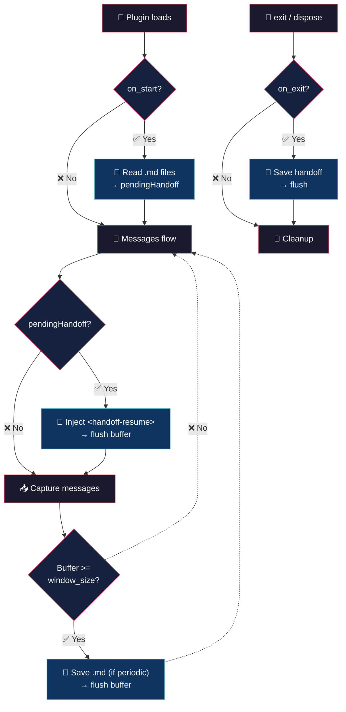

# Auto Handoff — (your session is safe)


> You close OpenCode, come back the next day and all context is gone? You have to re-explain everything from scratch? Not anymore!

## 💡 What it does

> Close OpenCode without losing the thread.

- **Auto save** — circular buffer (`window_size`) writes .md on each cycle if `periodic: true`. Plain text, readable, versionable.

- **Auto resurrection** — close saves, open reads. Everything is back where you left it.

- **No commands, no DB** — just .md files you can read, delete, or push to git.

## 🧠 Philosophy

The handoff speaks the same language as the model. What the model writes, another model reads. No translation, no loss.

On load, it recovers only the conversation — no headers, no metadata, no junk. Just pure chat back into context.

## 🔄 How it works

The plugin uses a single hook — `experimental.chat.messages.transform` — for both handoff injection and message capture:

1. **Injection (once, on first turn):** if `on_start` is true and handoff files exist, `injectHandoff()` unshifts a `<handoff-resume>` user message into `output.messages`. The buffer is flushed after injection.
2. **Capture (every turn):** iterates `output.messages`, deduplicates via `seenMessageIds` + `isDedup`, extracts clean text, pushes to circular buffer.
3. **Periodic write (if `periodic: true`):** when buffer reaches `window_size`, writes `.handoff/<ts>.md`, then flushes.

On startup, `.handoff/*.md` files are parsed via `parseFeedback()` into `pendingHandoff`. On exit/dispose the buffer is saved and rotated (FIFO, `max_stored_files`).



| Trigger | When | Action |
|---|---|---|---|
| `on_start` | plugin load | reads latest `.handoff/<ts>.md` files, extracts messages via `parseFeedback()`, stores as `pendingHandoff` |
| first `messages.transform` call | first turn | calls `injectHandoff()` — unshifts `<handoff-resume>` user message to `output.messages`, clears pending, flushes buffer |
| each `messages.transform` call | every turn | deduplicates and captures user+assistant messages into buffer |
| buffer >= `window_size` + `periodic: true` | buffer fills | writes `.handoff/<ts>.md`; always cycles buffer |
| `dispose` hook | clean shutdown | reads latest message via API, writes handoff, removes exit listener |
| `process.once("exit")` (process listener, not an OpenCode hook) | session ends | saves whatever was captured so far |

## 🚀 Installation

```bash
cp auto-handoff.ts ~/.config/opencode/plugins/auto-handoff.ts
```

The plugin loads automatically when OpenCode starts. No manual registration required.

## ⚙️ Configuration

Copy `auto-handoff.jsonc` (included in this repo) to `~/.config/opencode/` and edit:

```jsonc
{
	"enabled": true,           // master switch
	"on_exit": true,           // write handoff on dispose/exit
	"on_start": true,          // load recent handoffs on startup
	"window_size": 20,         // max buffer size; cycles when full, writes if periodic
	"periodic": true,          // write .md file on every buffer cycle
	"max_stored_files": 10,    // max .handoff/*.md files to keep (rotation)
	"max_load_files": 5,       // max recent handoff files to load on startup
	"log_level": "info",       // silent, error, info, debug
}
```

| Field | Default | Description |
|---|---|---|
| `enabled` | `true` | master switch |
| `on_exit` | `true` | write handoff on dispose/exit |
| `on_start` | `true` | load recent handoffs on startup |
| `window_size` | `20` | max buffer size; cycles when full (min 1). If `periodic: true`, writes `.md` on each cycle |
| `periodic` | `true` | write `.md` file on every buffer cycle |
| `max_stored_files` | `10` | max `.handoff/*.md` files to keep (rotation, min 1) |
| `max_load_files` | `5` | max recent handoff files to load on startup (min 1) |
| `log_level` | `"info"` | log level (`silent`, `error`, `info`, `debug`) |

If the file doesn't exist, defaults are used.

## 🪵 Logs

`~/.config/opencode/auto-handoff.log` (append-only). Format: `[TIMESTAMP] [LEVEL] message`.

```bash
tail -f ~/.config/opencode/auto-handoff.log
```

```log
[2026-07-05T10:30:00] [INFO]: Config loaded
[2026-07-05T10:30:01] [INFO]: Initialized | project: /home/user/myapp
[2026-07-05T10:35:12] [INFO]: Handoff written: periodic (21 messages): .handoff/2026-07-05-1035.md
[2026-07-05T10:40:23] [INFO]: Handoff loaded: 3 file(s), 15 messages
[2026-07-05T10:41:00] [INFO]: Handoff injected: 15 messages, 2875 bytes
[2026-07-05T10:50:00] [INFO]: Handoff written: exit (10 messages): .handoff/2026-07-05-1050.md
[2026-07-05T10:50:01] [INFO]: Disposed
[2026-07-05T11:00:00] [DEBUG]: Handoff skipped (no messages): exit
```

## 📝 Output format

Each handoff is a `.md` file in `.handoff/<timestamp>.md`:

```markdown
# Handoff — 2026-07-03-1527

## Reason
periodic (21 messages)

- [user] hola
- [assistant] hola. sesión cargada...
- [user] siguiente mensaje del usuario
- [assistant] respuesta del assistant
- ...
```

Messages are dumped in chronological order with a `[user]` or `[assistant]` prefix to mark the role. Internal markdown content of each message (headers, bold, lists) is preserved as-is.

## 🔌 Plugin hooks

| Hook | Purpose |
|---|---|---|
| `experimental.chat.messages.transform` | injects pending handoff via `injectHandoff()` (once), captures and deduplicates messages, writes .md on buffer cycle (if periodic) |
| `dispose` | reads latest via API, writes handoff, removes exit listener |
| `process.once("exit")` | saves on session close (Node process listener, not an OpenCode plugin hook) |

## 💬 Notes

- Injected `<handoff-resume>` is marked `synthetic: true` so OpenCode treats it as system content, not a real user turn.

Less is more. :)

## 👤 Authors

- Alejandro Carraretto
- MiniMax-M3

## 📄 License

MIT — version 1.1.10
