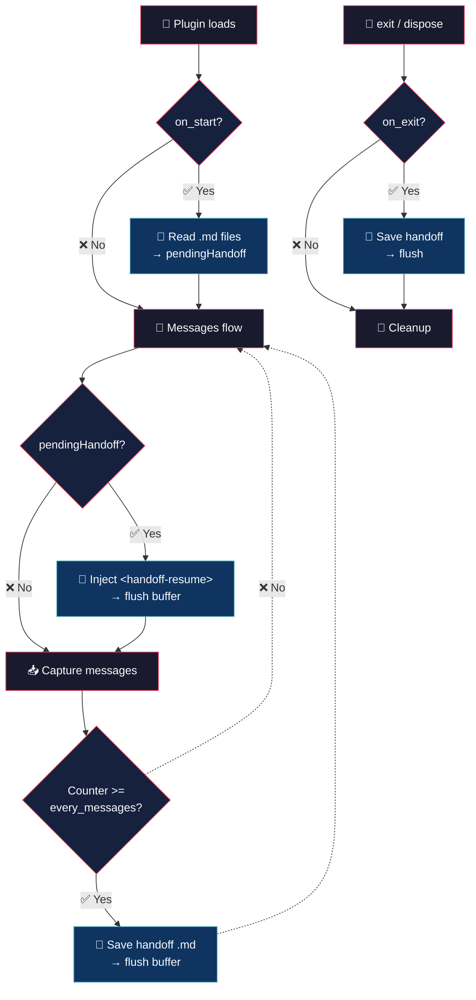

# Auto Handoff — (your session is safe)


> You close OpenCode, come back the next day, and all context is gone. You have to re-explain everything from scratch.

## 💡 What it does

> Close OpenCode without losing the thread.

- **Auto save** — every N messages dumps to a .md file. Plain text, readable, versionable.

- **Auto resurrection** — close saves, open reads. Everything is back where you left it.

- **No commands, no DB** — just .md files you can read, delete, or push to git.

## 🧠 Philosophy

The handoff speaks the same language as the model. What the model writes, another model reads. No translation, no loss.

On load, `parseFeedback` extracts only the messages — no headers, no metadata, no junk. Just pure conversation back into context.

## 🔄 How it works



| Trigger | When | Action |
|---|---|---|
| `every_messages` | message counter (user + assistant) reaches N | writes `.handoff/<ts>.md` |
| `dispose` hook | clean shutdown | writes handoff (if `on_exit: true`) |
| `process.once("exit")` | session ends | writes handoff (structural dedup via `flushMessages()`) |
| `on_start` | plugin load | reads latest `.handoff/<ts>.md` files, extracts full messages via `parseFeedback()`, stores as `pendingHandoff` |

## 🚀 Installation

```bash
cp auto-handoff.ts ~/.config/opencode/plugins/
```

The plugin loads automatically when OpenCode starts. No manual registration required.

## ⚙️ Configuration

Copy `auto-handoff.json` (included in this repo) to `~/.config/opencode/` and edit:

```json
{
	"every_messages": 20,
	"on_exit": true,
	"on_start": true,
	"keep_last": 20,
	"max_stored_files": 10,
	"max_load_files": 3,
	"log_level": "info"
}
```

| Field | Default | Description |
|---|---|---|
| `every_messages` | `20` | writes a handoff every N messages (user + assistant). `0` = never periodic, only dispose/exit |
| `on_exit` | `true` | writes on session close |
| `on_start` | `true` | reads latest handoffs on start |
| `keep_last` | `20` | how many recent messages each handoff includes (minimum 1) |
| `max_stored_files` | `10` | max `.md` files kept in `.handoff/` (auto-rotation, minimum 1) |
| `max_load_files` | `3` | how many recent handoffs are loaded on start (minimum 1) |
| `log_level` | `"info"` | log level (`silent`, `error`, `info`, `debug`) |

If the file doesn't exist, defaults are used.

## 🪵 Logs

`~/.config/opencode/auto-handoff.log` (append-only). Format: `[ISO_TIMESTAMP] [LEVEL] message`.

```bash
tail -f ~/.config/opencode/auto-handoff.log
```

```log
[2026-07-05T10:30:00.000Z] [INFO]: Config loaded
[2026-07-05T10:30:01.000Z] [INFO]: Initialized | project: /home/user/myapp | cfg: {"every_messages":20,...}
[2026-07-05T10:35:12.000Z] [INFO]: Handoff written: periodic (21 messages): .handoff/2026-07-05-1035.md
[2026-07-05T10:40:23.000Z] [INFO]: Handoff loaded: 3 file(s)
[2026-07-05T10:41:00.000Z] [INFO]: Handoff injected into context
[2026-07-05T10:50:00.000Z] [INFO]: Handoff written: exit: .handoff/2026-07-05-1050.md
[2026-07-05T10:50:01.000Z] [INFO]: Disposed
[2026-07-05T10:55:00.000Z] [ERROR]: write failed: disk full
[2026-07-05T10:56:00.000Z] [ERROR]: messages.transform: cannot parse
[2026-07-05T11:00:00.000Z] [DEBUG]: Handoff skipped (no messages): exit
```

## 📝 Output format

Each handoff is a `.md` file in `.handoff/<timestamp>.md`:

```markdown
# Handoff — 2026-07-03-1527

## Reason
periodic (21 messages)

- [user] hola
- [assistant] hola. sesión cargada...
- [user] siguiente mensaje del usuario
- [assistant] respuesta del assistant
- ...
```

Messages are dumped in chronological order with a `[user]` or `[assistant]` prefix to mark the role. Internal markdown content of each message (headers, bold, lists) is preserved as-is.

## 🔌 Plugin hooks

| Hook | Purpose |
|---|---|
| `experimental.chat.messages.transform` | injects pending handoff (once), captures user + assistant messages, writes handoff every N |
| `process.once("exit")` | auto-write on session close |
| `dispose` | cleanup (removes listener, auto-writes) |

## 💬 Notes

Less is more. :)

## 👤 Authors

- Alejandro Carraretto
- MiniMax-M3

## 📄 License

MIT — version 1.0.31
