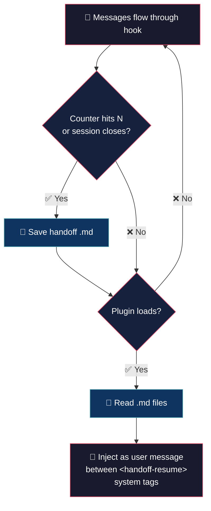

# Auto Handoff — (your session is safe)


> Closed OpenCode and came back the next day without context? This plugin brings
> it back automatically. Every N messages it saves a snapshot of your session to
> a `.md` file. On close, it saves another. On open, it reads the most recent
> ones and injects them as a user message with sentinel `id: "handoff-resume"`.
> No commands, no keywords, no database — just text files you can read, version,
> or delete.

## 💡 What it does

- **Periodic save** — writes a handoff every N total messages (user + assistant, default: 20)

- **Save on exit** — writes a handoff when OpenCode closes

- **Load on start** — reads the latest handoffs when the plugin loads and injects them as a user message with sentinel `id: "handoff-resume"`

Zero keywords. Automatic snapshots + automatic resume.

The injected handoff is wrapped in `<handoff-resume>...</handoff-resume>` XML tags so downstream parsers can identify or filter it.

## 🧠 Philosophy

This handoff speaks the same language as the model. The format the model writes is the format another model reads. Clean roundtrip, no context loss.

On load, `parseFeedback` extracts message lines (`- [user]` / `- [assistant]`) with full multi-line body preservation — headers and metadata are discarded, so only complete conversation content feeds back into context.

## 🔄 How it works



| Trigger | When | Action |
|---|---|---|
| `every_messages` | message counter (user + assistant) reaches N | writes `.handoff/<ts>.md` |
| `dispose` hook | clean shutdown | writes handoff (if `on_exit: true`) |
| `process.once("exit")` | session ends | writes handoff (structural dedup via `flushMessages()`) |
| `on_start` | plugin load | reads latest `.handoff/<ts>.md` files (chronological order, oldest first), extracts full messages via `parseFeedback()`, stores as `pendingHandoff` |

## 🚀 Installation

```bash
cp auto-handoff.ts ~/.config/opencode/plugins/
```

The plugin loads automatically when OpenCode starts. No manual registration required.

## ⚙️ Configuration

File: `~/.config/opencode/auto-handoff.json`

```json
{
	"every_messages": 20,
	"on_exit": true,
	"on_start": true,
	"keep_last": 20,
	"max_stored_files": 10,
	"max_load_files": 3,
	"log_level": "info"
}
```

| Field | Default | Description |
|---|---|---|
| `every_messages` | `20` | writes a handoff every N messages (user + assistant). `0` = never periodic, only dispose/exit |
| `on_exit` | `true` | writes on session close |
| `on_start` | `true` | reads latest handoffs on start |
| `keep_last` | `20` | how many recent messages each handoff includes (minimum 1) |
| `max_stored_files` | `10` | max `.md` files kept in `.handoff/` (auto-rotation, minimum 1) |
| `max_load_files` | `3` | how many recent handoffs are loaded on start (minimum 1) |
| `log_level` | `"info"` | log level (`silent`, `error`, `info`, `debug`) |

If the file doesn't exist, defaults are used.

## 📝 Output format

Each handoff is a `.md` file in `.handoff/<timestamp>.md`:

```markdown
# Handoff — 2026-07-03-1527

## Reason
periodic (21 messages)

- [user] hola
- [assistant] hola. sesión cargada...
- [user] siguiente mensaje del usuario
- [assistant] respuesta del assistant
- ...
```

Messages are dumped in chronological order with a `[user]` or `[assistant]` prefix to mark the role. Internal markdown content of each message (headers, bold, lists) is preserved as-is.

## 🔌 Plugin hooks

| Hook | Purpose |
|---|---|
| `experimental.chat.messages.transform` | injects pending handoff (once), captures user + assistant messages, writes handoff every N |
| `process.once("exit")` | auto-write on session close |
| `dispose` | cleanup (removes listener, auto-writes) |

## 💬 Notes

Less is more. :)

## 👤 Authors

- Alejandro Carraretto
- MiniMax-M3

## 📄 License

MIT — version 1.0.31
